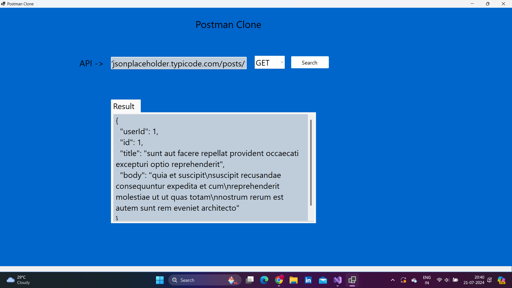
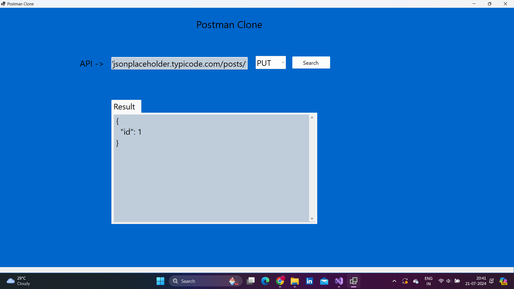
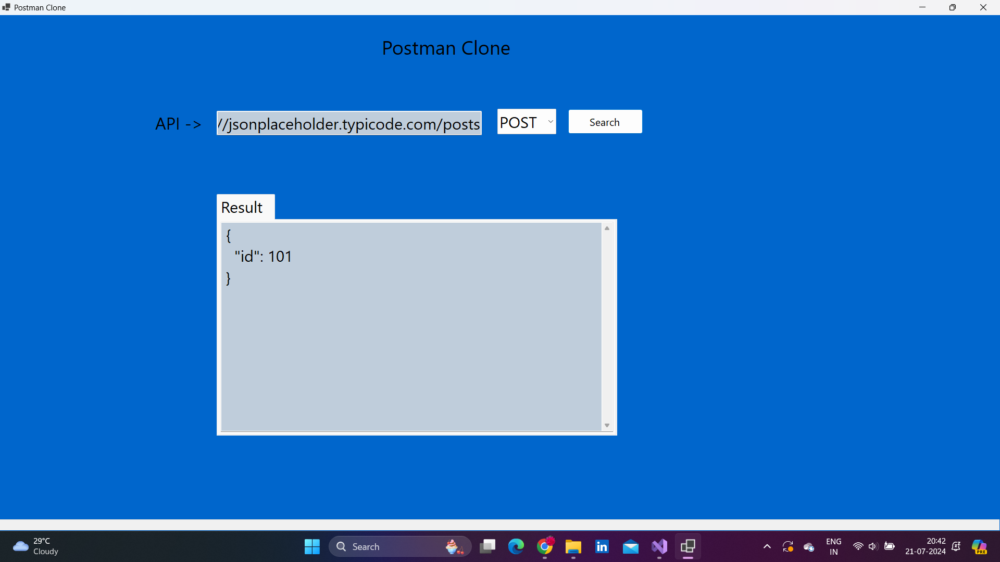
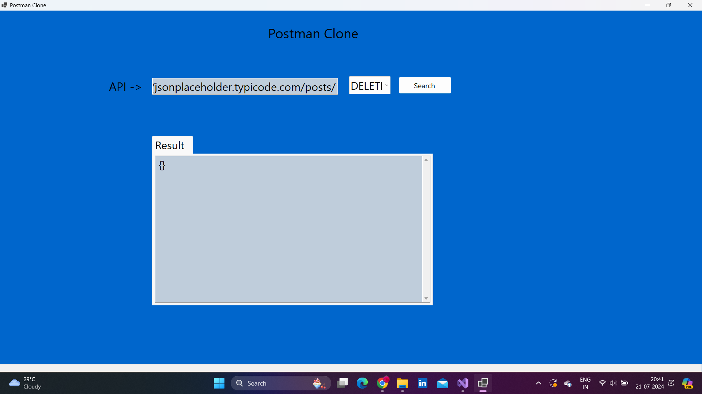
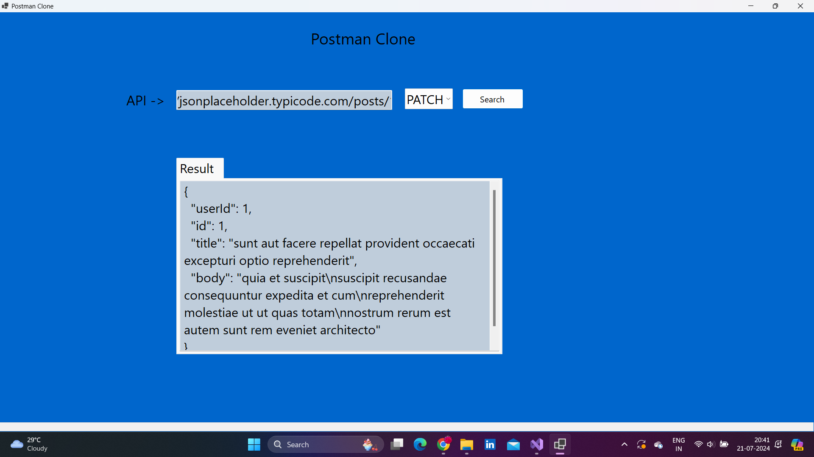

# Postman Clone

Postman Clone is a user-friendly application that allows users to interact with APIs. It provides a graphical interface to input an API URL and select the desired HTTP method. The application then retrieves the response from the API and displays the result in a formatted JSON view.

## Features

- **User-Friendly Interface**: Easy-to-use graphical interface for API interaction.
- **HTTP Method Selection**: Support for GET, POST, PUT, DELETE, and PATCH methods.
- **Formatted JSON Response**: Response is displayed in a readable, formatted JSON format.

## Images

## Technologies Used

- C#
- .NET 8
- Winforms
- HttpClient

## Usage

- **Enter API URL**: Input the API URL into the provided text box.
- **Select HTTP Method**: Choose the desired HTTP method (GET, POST, PUT, DELETE, PATCH) from the dropdown menu.
- **Submit Request**: Click the button to send the request to the API.
- **View Results**: The response will be displayed in a formatted JSON view in the result area.

